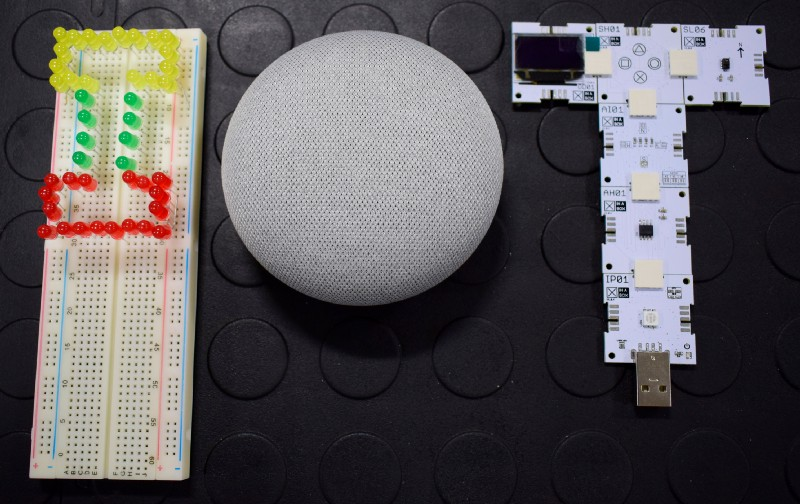

# Enterprise IoT as the backbone of change

## The "I" in IoT

We’re moving into an Internet-of-everything age faster than we can turn a kettle on. As the people who create software, you may think this has less to do with us than the people creating the devices. But for me, the building of the actual devices is less important than the “I” in IoT.

The Internet-of-Things (IoT) is the idea of taking previously non-smart electronic devices and enabling them to share data and make decisions based on that data. An important aspect to consider in writing software for these intelligent devices is around how they will connect to each other or the internet — and that’s where we come in.

When writing software for enterprise IoT devices, the support of the technologies used needs to be carefully considered. There are several wireless technologies that could be used: WiFi, NFC, Bluetooth, and they all have different benefits and drawbacks. If your device is relying on one type of wireless technology to speak to the internet, it might use a different one to connect to others.

It is incredibly important that we ensure these connections are all secure. The more connected your devices are, the more exposed you would be to malicious attacks. Even if you think that your WiFi-enabled lightbulbs are not much of a security risk, it could be a path into your entire home network. Once a cyber attacker gains access to this network, they will inevitably find that old Word document you once saved with all your passwords. This may not seem like a problem when the only thing your devices are doing is home automation, but when we’re talking about internet connected ‘things’ containing key data to your company’s operations, it’s a different story. This is why we’re smart programmers who always secure our software right?

Depending on the methods used to connect devices, you can leverage off existing platforms and features for securing the software and pushing security updates whenever necessary.

In a talk I recently attended, I heard that Cisco has reported that by 2020, there will be more than 30 billion devices connected to the Internet, and that there is already 5 quintillion bytes of data produced every day. We need to consider how to handle all of the data large-scale companies are generating. Ultimately, we need to ensure that what we do with the data is of benefit to our clients.

Maybe the biggest realisation is that the Fourth Industrial Revolution is here, and IoT is a very big part of it. Helping deliver business value across operations, supply chains and customers, lowering costs and increasing revenue. And because IoT forms the backbone of change, it is a disruptive technology we need to harness.

We are heading towards a future where devices make intelligent decisions on their own, only connecting to others or the internet when necessary. The software we create now, will grow and adapt to make this possible and benefit companies everywhere.

We’re not there yet, but watching all of this happen sure is exciting.

Written with some help from [Katie Cubitt](https://twitter.com/Katescub).