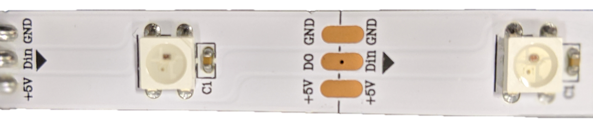

# Lights and sounds with the Raspberry Pi Zero

IoT projects can be tons of fun, but figuring out all the hardware stuff is not always easy. As I mentioned in my [previous post](https://medium.com/@gerybbg/lightsaber-prototyping-with-the-nordic-thingy-52-890d54493b86), my team and I are building a lightsaber. A lightsaber requires at least two things, lights and sounds. In this post I will tell you how to set up an RGB LED strip (WS2812b), a sound hat (WM8960) and a button to control them both, on the Pi Zero. I will talk about the mistakes I made, and what you can do to avoid them, as well as the libraries I ended up using.

My Raspberry Pi Zero is running Raspbian Buster Lite, and I followed [this tutorial](https://www.losant.com/blog/getting-started-with-the-raspberry-pi-zero-w-without-a-monitor) to set it up.

## Sound

Setting up the sound hat is actually not that difficult. You just need to install the drivers:

- `git clone https://github.com/waveshare/WM8960-Audio-HAT`
- `cd WM8960-Audio-HAT`
- `sudo ./install.sh`
- `sudo reboot`

After you reboot you should be able to test that the sound works with the following command `speaker-test -c2 -twav -l7`.

As you may have noticed from my previous posts, I am a big JavaScript fan, so that is why the first thing I tried was to play the sound I needed with a JavaScript library called [play-sound](https://www.npmjs.com/package/play-sound). It is super easy to use:

```js
const player = require('play-sound')(opts = {});

player.play('my-sound.wav', (err) => {
  if (err) console.log(err);
});
```

I did not have any problems with it (until I connected the button, but more on that later).

## Lights


There are quite a lot of tutorials online about how to set up a WS2812b LED strip on your Raspberry Pi, some of them mention that it should be the exact same for the Pi Zero as well (it is). However, I had a few problems.

Firstly, I could not use the PWM (Pulse Width Modulation) pin, because that is the same pin that is being used by the sound. I eventually found [a library](https://github.com/jgarff/rpi_ws281x) that explained that if you need to use both sound and the LED strip, you can use the SPI (Serial Peripheral Interface) instead. I decided to use the Python version, since there was no JavaScript. I set it all up and nothing worked.

I thought that my next problem, was a power problem. A lot of the tutorials mention that if you have more than 30 LEDs (I had 45) you need external power. I measured with my multi-meter, and it showed that everything was fine, it wasn't a power problem. I was pulling my hair out, trying different libraries, trying just a single LED, nothing worked.

I looked a bit more closely, at one last tutorial, and realised something. Their strip had an arrow on it, for the direction that you are supposed to connect the wires. And then I looked closely at my LED strip:



There is an arrow, and my wires were soldered onto the wrong end of it.

So... If you solder your wire to the correct end of the LED strip, it's actually really easy to setup the Python library. You install it using pip `sudo pip install rpi_ws281x` and you can use it like this:

```python
#!/usr/bin/env python3

import time
from rpi_ws281x import PixelStrip, Color
import sys

# LED strip configuration:
LED_COUNT = 45
LED_PIN = 10
LED_FREQ_HZ = 800000
LED_DMA = 10
LED_BRIGHTNESS = 255
LED_INVERT = False
LED_CHANNEL = 0

strip = PixelStrip(LED_COUNT, LED_PIN, LED_FREQ_HZ, LED_DMA, LED_INVERT, LED_BRIGHTNESS, LED_CHANNEL)
strip.begin()

for i in range(strip.numPixels()):
    strip.setPixelColor(i, 255, 0, 0)
    strip.show()
    time.sleep(0.0200)
```

This script turns on the LEDs (in red) one by one with a short delay in between. You can see that we are setting the `LED_PIN` to 10, that is the only SPI pin on the Pi. You have to also enable the SPI interface:

- Run `sudo raspi-config`
- Go to **Interfacing Options**
- Select **SPI**
- Select **Yes**
- Reboot the Pi

You also need to change the maximum byte transfer and frequency of the SPI bus:

- In `/boot/cmdline.txt` append `spidev.bufsiz=32768`
- In `/boot/config.txt` add `core_freq=250`
- Reboot the Pi

After this, if all is connected correctly, your LED strip will work (you do have to run it with `sudo`).

## Button

The button should have been the easiest thing to connect. There are many libraries for GPIO (General Purpose Input Output) out there, some that I have used previously, so I thought I'd try them again, for example:

- [Johnny-Five](http://johnny-five.io/)
- [onoff](https://www.npmjs.com/package/onoff)
- [gpiozero](https://gpiozero.readthedocs.io/en/stable/index.html)
- [RPi.GPIO](https://pypi.org/project/RPi.GPIO/)

I tried JavaScript first, hence the first two, but I eventually settled for the last one. See I was having this weird problem, and it took me a while to figure out that it was not the library's fault. Every time I ran the code for the button, the sound would stop working, on reboot, it would be fixed again. It took me hours to figure this out, but it has to do with the fact that the PWM pin on the Raspberry Pi Zero, is kind of a normal GPIO pin and there is software that makes it into a PWM pin. There are other pins like this on the Pi, and if you happen to connect your button to one of those, it breaks the sound. I'm not sure if this is documented anywhere, but the way I figured it out was via trial and error.

You install the library with pip using the command `pip install RPi.GPIO` and this is the code you can use to detect if the button (connected to GPIO pin 26) is pressed or not:

```python
import RPi.GPIO as GPIO

GPIO.setmode(GPIO.BCM)
GPIO.setwarnings(False)

GPIO.setup(26, GPIO.IN, GPIO.PUD_UP)

if GPIO.input(26):
    print("pressed")
else:
    print("released")
```

## Summary

Those are the three main components that I needed working on the Raspberry Pi so that we could have a functioning lightsaber. There were quite a few problems along the way, but it's all working together now. I'm hoping that this tutorial will help you if you are struggling with any of the same problems. Keep an eye out here as well as on [Twitter](https://twitter.com/GerybBg) for future updates on how the lightsaber building is going (we're very close to V1.0).