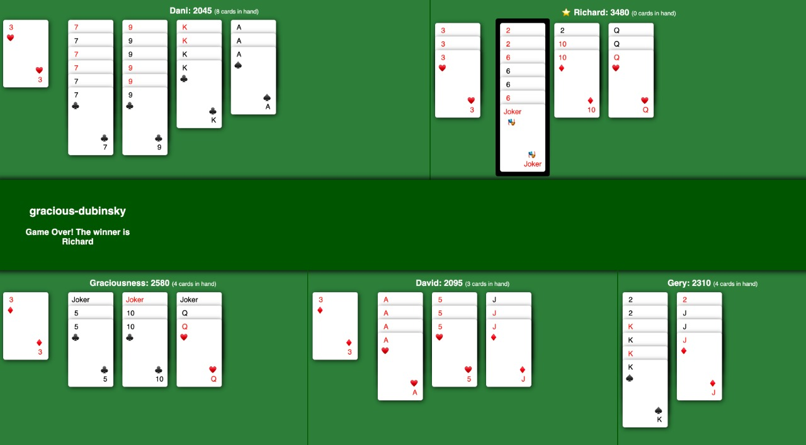
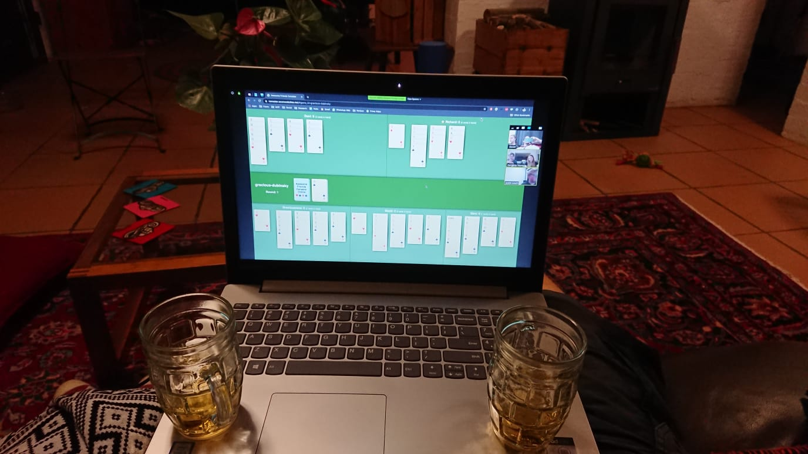

A little while ago friends of ours taught us how to play a card game called Canaster. We played it a couple of times, but since the whole self isolation and quarantine thing started, we haven't been able to play. A couple of weeks ago, I started looking online to see if I could find a version we could play even though the four of us could not be together. In my research I found that this game is really popular, but there was one problem. It seems that everyone has slightly different rules for it, and no one seemed to have the same rules that we were taught.

So, one Sunday, my husband and I decided it was time to build our own Canaster, the way we wanted to play it with our friends. We got the main idea after playing some games from [Jackbox Games](https://www.jackboxgames.com/). We decided to build the entire thing using JavaScript and as few helper libraries and frameworks as possible. In this post, I'd like to tell you a little bit about our technology choices, why we made them, and the things we still need to work on.

## The frontend

The frontend consists of 3 pages:

- The main page which displays the game in its current state and if there is no game selected it displays the navigation buttons. This is the page that the host computer would run and will be shared with the other players over whatever video calling software you are using.
- The rules page shows the rules as we learned them, in case someone stumbles across the game and wants to try it.
- The hand or player page, where every player can join an existing game and view their cards as well as perform different actions, like drawing or discarding cards. This would usually be accessed from the player's phone or another device which they are not using for the video call.

We also built a few vanilla JavaScript web components. These do things like show the cards, show each player, and pop-up error messages. This part was really fun as I had never built pure web components without using a library or framework before.

It can sometimes take a player a long time to decide what to do on their turn. This means that, depending on your device's settings, the screen starts turning off or locking. We decided to try implementing a _keep awake_ function. The first attempt involved the [Wake Lock API](https://www.w3.org/TR/wake-lock/), but due to it still being in an origin trial in Chrome, we decided that this would not work for us.

We then tried [NoSleep.js](https://github.com/richtr/NoSleep.js), we ran one complete game with this. While playing we noticed that my computer, which we were using as the host, had it's fan going crazy. After some digging we found [this issue](https://github.com/richtr/NoSleep.js/issues/66). We have now decided that, at least for the time being, we are going to remove this library and just rely on the players to keep their devices awake. When we find a better solution, I will definitely write another post about it.

## The server

We built the server using Node and Express, this we chose because we have of experience in it, so it was the easiest option. The hardest part about the server was implementing all of the rules. We started out by hard coding a lot of them, but then I realized that this won't work for long. There were a lot of places that needed the same rule, and hard coding meant that if we wanted to change it, we would need to change it multiple times. We created a separate rules object that we could export and import into any page that needed it.

There is still one section of this code that needs to be refactored and cleaned up because it contains pretty much all of the rules of the game. Other than that, and a few more hard coded rules, we are pretty much done with the server.

One of the interesting things we decided to use was the Node `--experimental-modules` flag. This is an experimental feature which allows us to use `import` and `export` for `.js` files in Node, rather than having to use the `require` syntax. We are using Node v12, so the feature is not enabled by default, this means there are two things we have to do in order to be able to use modules:

1. Add the type field to your `package.json` file: `"type": "module"`
2. Add the `--experimental-modules` when you run the code: `node --experimental-modules index.js`

If you are interested in reading more about this experimental feature, take a look these [Node v14 docs](https://nodejs.org/api/esm.html).

## Communication

Since we were using Node with Express we could easily create endpoints. These endpoints are accessed by the front-end using the [Fetch API](https://developer.mozilla.org/en-US/docs/Web/API/Fetch_API).

Although, how does a player know it is their turn and how does the main game screen know whose turn it is and what cards are being played. We decided it was time to introduce web sockets with [socket.io](https://socket.io/). In order to keep all of the different games separate, as well as separate the messages sent to the main screen and the player we decided to use [rooms](https://socket.io/docs/rooms-and-namespaces/) for our sockets. These rooms allow us to limit the information being sent by giving the socket you are connecting to a name, you will then only receive the data sent to that specific name.

## Data

Storing the game state is still a bit of a problem in the current version of the game. Everything is currently stored in memory, this comes with a few problems:

- If the server restarts, we loose the games that were being played.
- If it doesn't restart, there is currently no way to delete the games, so the server will eventually run out of memory.

The reason we chose this, is because having a datastore is relatively expensive in the cloud hosting world. However, we are planning on trying to find a way to fix this in future.

As for the second problem, being able to delete a game can be added as an extra button on the screen, but we can't rely on people clicking it. So the plan is to add an Azure function that will run once every night and delete all games that are older than 24 hours. More on how to build a function like this will come in a future post.

## Hosting

We decided to use Azure as a hosting platform. If you'd like to learn more about how to automatically deploy your Node applications to Azure using pipelines, take a look at [this post I wrote about it](https://dev.to/gerybbg/restify-lit-html-and-azure-pipelines-3n5n). It talks about using Restify and lit-html, but can easily be adapted to any other Node backend.

## Security

Well, please don't judge, there is none, unless you count that it runs on HTTPS. There are two of things that we need to fix:

- The endpoints are accessible from the browser, i.e. you can get the entire game state and see other people's cards if you know the correct endpoint to go to.
- If another person with the same name as you enters the same game as you they will be able to see your hand.

We have ideas on how to fix both of these problems, so fixes for them are coming soon.

## Conclusion

Even though we spent a few days on a weekend building this game, it is actually turning out to be exactly what we wanted. You can check out the code on [GitHub](https://github.com/geryb-bg/canaster) if you are interested. There are still some problems, it needs some refactoring and a bit less hard coding. It has been fun trying to get all of the different parts working together and we are going to continue improving it. I hope this inspires some people to build a game they miss playing with their friends. You never know what you'll learn in the process.
