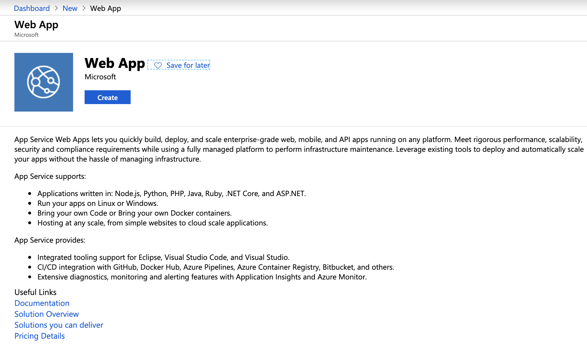
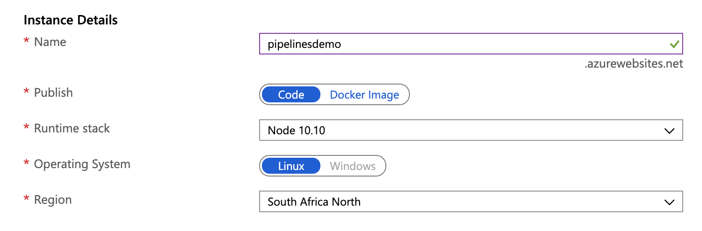
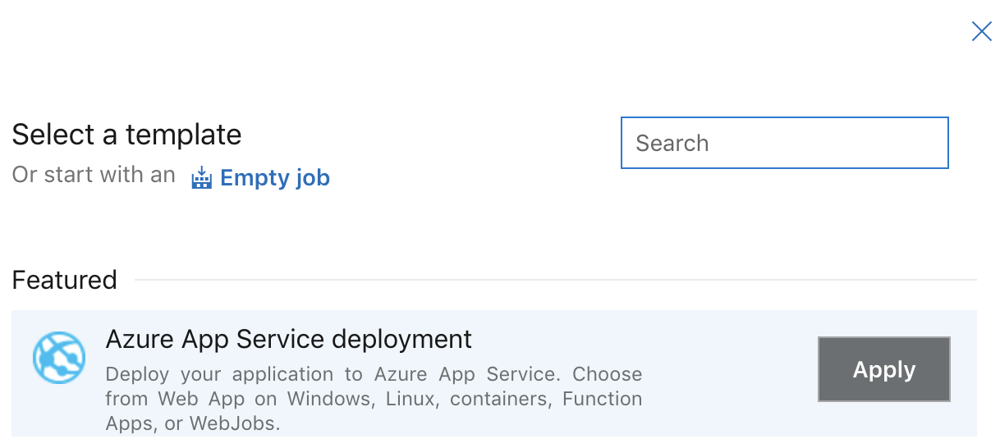
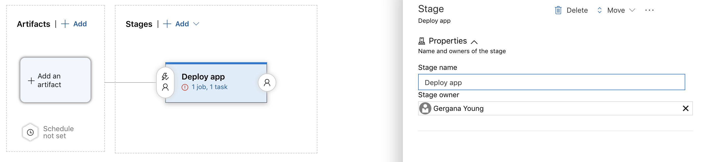
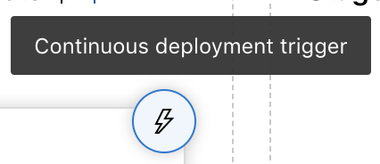

# Restify, lit-html and Azure Pipelines


Azure DevOps (formerly TFS) is a set of services created by Microsoft to make CI/CD easier for projects. We have been using it for the last seven months as source control. Recently, we had to deploy one of our old applications to an Azure Web App and we decided it was time to try some of the other features of Azure DevOps, the Pipelines. The pipeline we created ensures that every push to the master branch of our project goes straight to production (no pressure).

I went through a few different tutorials on how to build and deploy using the pipelines, but I kept missing something and things were just not working. This is why I decided to write this post with a step by step guide on what I did, in case someone else runs into the same problems I did. 

We will be deploying a very simple web app which uses [LitElement](https://lit-element.polymer-project.org/) and [restify](http://restify.com/). We will start by putting the code in a private repo on Azure DevOps. We will then create a Web App in Azure. The last two things we will need are the two pipelines, one that will build our code and one that will deploy it to Azure on a successful build. Let's get started.

## The app

The app we will be using can be found in [this GitHub repo](https://github.com/geryb-bg/pipelines-demo). Using Azure Pipelines it is possible to deploy directly from GitHub, but in this example I would like to show you how we can do it from a repo on Azure DevOps. Get the code from the repo above and let's start by creating a project. Go to [Azure DevOps](https://dev.azure.com) and create an account if you do not have one already. Create a new project and click on repos, follow the instructions to create a repo and commit the code above into that repo. Once our code is pushed, we are ready to start with the deployment.

## The web app

We need to create an app service plan and a web app on Azure. Open the [Azure portal](https://portal.azure.com) and click on create new resource, search for Web App and click create.



Fill in all of the required details, remembering to choose the publish method as code and the operating system as Linux.



Once the web app is created, we have to add the port on which it will run. We do this by going to the Configuration settings and under "Application Settings" add a new setting with name "PORT" and value "8080". Now we can start the deployment.

## The build pipeline

The first thing we need to do is create a build pipeline that will build our code (and test it when we add tests). We need to create a file in the root of our directory named `azure-pipelines.yml`. This file will define all of the steps we need to build our code. It will look like this:

```
trigger:
  - master

pool:
  vmImage: 'Ubuntu-16.04'

steps:
  - task: NodeTool@0
    inputs:
      versionSpec: '10.x'
    displayName: 'Install Node.js'

  - script: |
      npm install
      npm run-script build
    workingDirectory: app
    displayName: 'Install the app dependencies and build the bundle'

  - script: |
      npm install
    workingDirectory: api
    displayName: 'Install the server dependencies'

  - task: CopyFiles@2
    inputs:
      SourceFolder: '$(System.DefaultWorkingDirectory)/api'
      Contents: |
        **/*
        *
        !node_modules/
      TargetFolder: '$(Build.ArtifactStagingDirectory)/api'

  - task: CopyFiles@2
    inputs:
      SourceFolder: '$(System.DefaultWorkingDirectory)/app/build/default'
      Contents: |
        **/*
        *
        !node_modules/
      TargetFolder: '$(Build.ArtifactStagingDirectory)/api/public'

  - task: DeleteFiles@1
    inputs:
      SourceFolder: '$(Build.ArtifactStagingDirectory)/api/public'
      Contents: src/services/config.js

  - task: CmdLine@2
    inputs:
      Script: 'mv config.prod.js config.js'
      WorkingDirectory: '$(Build.ArtifactStagingDirectory)/api/public/src/services'

  - task: PublishBuildArtifacts@1
    inputs:
      pathtoPublish: '$(Build.ArtifactStagingDirectory)/api'
      artifactName: api
```

There are eight steps in total, they do the following:

**Step 1:** Install Node on the build agent.
```
- task: NodeTool@0
  inputs:
    versionSpec: '10.x'
  displayName: 'Install Node.js'
```

**Step 2:** Install the dependencies for the web app and build it using the polymer cli.
```
- script: |
    npm install
    npm run-script build
  workingDirectory: app
  displayName: 'Install the app dependencies and build the bundle'
```

**Step 3:** Install the dependencies for the API.
```
- script: |
    npm install
  workingDirectory: api
  displayName: 'Install the server dependencies'
```

**Step 4:** Copy all of the api files to the build directory.
```
- task: CopyFiles@2
  inputs:
    SourceFolder: '$(System.DefaultWorkingDirectory)/api'
    Contents: |
      **/*
      *
      !node_modules/
    TargetFolder: '$(Build.ArtifactStagingDirectory)/api'
```

**Step 5:** Copy all of the app files to the `public` folder in the `api` build directory.
```
- task: CopyFiles@2
  inputs:
    SourceFolder: '$(System.DefaultWorkingDirectory)/app/build/default'
    Contents: |
      **/*
      *
      !node_modules/
    TargetFolder: '$(Build.ArtifactStagingDirectory)/api/public'
```

**Step 6:** Delete the development configuration file.
```
- task: DeleteFiles@1
  inputs:
    SourceFolder: '$(Build.ArtifactStagingDirectory)/api/public'
    Contents: src/services/config.js
```

**Step 7:** Rename the production configuration file.
```
- task: CmdLine@2
  inputs:
    Script: 'mv config.prod.js config.js'
    WorkingDirectory: '$(Build.ArtifactStagingDirectory)/api/public/src/services'
```

**Step 8:** Publish all of the files from the build directory.
```
- task: PublishBuildArtifacts@1
  inputs:
    pathtoPublish: '$(Build.ArtifactStagingDirectory)/api'
    artifactName: api
```

If we push this file to Azure DevOps and go into Pipelines > Builds, we will see our build pipeline. 

## The release pipeline

Now that our code is building successfully, it is time to deploy it to Azure. We will do that by using a release pipeline that is triggered by a successful build. Click on Pipelines > Releases > Create a new pipeline. In the select a template dialog choose "Azure App Service deployment".



Name the stage and then click on "Add an artifact".



Choose the source type as "Build" and choose the build pipeline we created earlier. Set the default version to latest and click add.

Click on the "Continuous deployment trigger" and set it to enabled, this way every time there is a successful build the release pipeline will be triggered.



Go into the stage settings by clicking on the link "1 job, 1 task". Choose your Azure subscription and change the app type to "Web App on Linux". This should load the app service we created earlier, select it from the drop down and leave the start up command blank.

Click on the "Deploy Azure App Service Task", here we can rename it to something more relevant, or leave it as is. The important thing that needs to change is the "Package or folder" location. Click on the 3 dots and you will see the artifacts that the build pipeline published. Navigate to the api folder and choose that as the folder to deploy. We can leave all the other settings and save our release pipeline.

To test it create a release from the latest build. Once the release completes, check that everything worked by going to `<yourwebsitename>.azurewebsites.net`.

## Summary

We have now successfully deployed our web app to Azure. Every time we push to the master branch on Azure DevOps our new code will be released to production. This can be both very useful and very dangerous. We need to ensure that every person on the team understands that all of their changes to the master branch will be immediately available for people to see and use. The code should be well tested and there should be some sort of pull request model in place. In this way we don't have to fear pushing to master and breaking something in production.