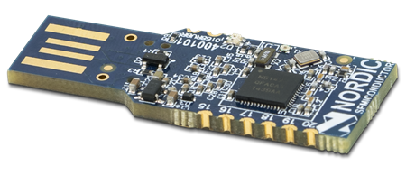

# Web Bluetooth by example



The Web Bluetooth API is quite a powerful feature of the web. It has a lot of potential and some really cool capabilities. However, getting started with it can be a little daunting. In this post I'd like to take you through building an example using the API with the [nRF52 dongle](https://www.nordicsemi.com/?sc_itemid=%7BCDCCA013-FE4C-4655-B20C-1557AB6568C9%7D). Before starting with the code, if you would like to know more about the theory of the Web Bluetooth API, checkout my previous post: [_BLE and GATT and other TLAs_](https://medium.com/@gerybbg/ble-and-gatt-and-other-tlas-d6619cb684dd).

We are going to be following a very similar example to my [_WebUSB by example_](https://medium.com/@gerybbg/webusb-by-example-b4358e6a133c) post, with most of the code adapted from Lars Knudsen's [GitHub repo](https://github.com/larsgk/web-nrf52-dongle). We will be building a website, from scratch, that will connect to the Bluetooth device, send data to it to update the colour of the LED and receive data that will be displayed on the screen.

## What you will need

- [nRF52 dongle](https://www.nordicsemi.com/?sc_itemid=%7BCDCCA013-FE4C-4655-B20C-1557AB6568C9%7D)
- [nrfutil](https://github.com/NordicSemiconductor/pc-nrfutil): for flashing the firmware onto the device
- [http-server](https://www.npmjs.com/package/http-server) (or something similar): for starting up our website locally
- A computer which has a built in Bluetooth module, or a USB Bluetooth dongle. I use [this one](https://www.kensington.com/p/products/connectivity/usb-hubs-adapters/kensington-bluetooth-4.0-usb-adapter/).

## The hardware

We need to ensure that the nRF52 dongle is flashed with the correct software so that we can access it's Bluetooth capabilities. If you have already done this, by following the instructions in my [_WebUSB_ post](https://medium.com/@gerybbg/webusb-by-example-b4358e6a133c), then you can skip to the next section. If you have not, then please keep reading.

We will be using [Zephyr](https://www.zephyrproject.org/), which is an operating system for small embedded devices. If you are interested in building the firmware and installing it yourself then you can take a look at the instructions on [Getting Started with Zephyr](https://docs.zephyrproject.org/latest/getting_started/index.html). Once you have it setup you will have to build the firmware and flash it onto the dongle by following [the instructions here](https://github.com/larsgk/web-nrf52-dongle/tree/master/dongle_firmware).

This tutorial is going to focus on the Web Bluetooth API, so you can just download the [packaged zip file](https://github.com/larsgk/web-nrf52-dongle/releases) from the repo and flash it onto the device with the command `nrfutil dfu serial -pkg pkg.zip -p /dev/ttyACM0` replacing the `/dev/ttyACM0` with the USB port that your device is plugged into.

## The Setup

As mentioned earlier, we are going to be building this website almost completely from scratch. Since the parts we are concentrating on will be the JavaScript, you can download the [HTML](https://github.com/geryb-bg/gery-web/blob/master/blog/WebBluetooth/Example/code/index.html) and [CSS](https://github.com/geryb-bg/gery-web/blob/master/blog/WebBluetooth/Example/code/styles.css) and just use them. There are a few things that need to be mentioned in the HTML file that we will be referring to when we get to writing our JavaScript:

- Three _buttons_ with IDs: `connectButton`, `disconnectButton` and `colourButton`.
- A _div_ with ID `connected`.
- An _input_ of type _color_ with ID `colourPicker`.
- A _span_ with ID `deviceHeartbeat`.

Let's create an `index.js` file and start by getting references to all of the elements we defined in our HTML:

```js
const connectButton = document.getElementById('connectButton');
const disconnectButton = document.getElementById('disconnectButton');
const colourPicker = document.getElementById('colourPicker');
const colourButton = document.getElementById('colourButton');

const connect = document.getElementById('connect');
const deviceHeartbeat = document.getElementById('deviceHeartbeat');
```

Next we should create variables for the service and characteristic unique identifiers for our BLE device. We have one service which we will be connecting to, and two characteristics, one for sending data and one for receiving data.

```js
const primaryServiceUuid = '12345678-1234-5678-1234-56789abcdef0';
const receiveCharUuid = '12345678-1234-5678-1234-56789abcdef1';
const sendCharUuid = '12345678-1234-5678-1234-56789abcdef3';
```

Now we are ready to connect to the device. When we click the connect button our browser will scan for the device, once connected we can show the rest of the elements on the page so we can interact with the device:

```js
let device, sendCharacteristic, receiveCharacteristic;
connectButton.onclick = async () => {
  device = await navigator.bluetooth
            .requestDevice({ 
                filters: [{ 
                    services: [primaryServiceUuid] 
                }] 
            });

  const server = await device.gatt.connect();
  const service = await server.getPrimaryService(primaryServiceUuid);

  receiveCharacteristic = await service.getCharacteristic(receiveCharUuid);
  sendCharacteristic = await service.getCharacteristic(sendCharUuid);

  device.ongattserverdisconnected = disconnect;

  connected.style.display = 'block';
  connectButton.style.display = 'none';
  disconnectButton.style.display = 'initial';
};
```

In the code above, we are also listening for the `ongattserverdisconnected` event. This can happen if the Bluetooth device goes out of range, or is disconnected for any reason. When we disconnect from the device we want to clean up, we do this as follows:

```js
const disconnect = () => {
  device = null;
  receiveCharacteristic = null;
  sendCharacteristic = null;

  connected.style.display = 'none';
  connectButton.style.display = 'initial';
  disconnectButton.style.display = 'none';
};
```

Another way we can disconnect from the device is by clicking the disconnect button. We can reuse the disconnect method above, but we also need to tell the browser we are disconnecting from the device:

```js
disconnectButton.onclick = async () => {
  await device.gatt.disconnect();
  disconnect();
};
```

Start up your website using _http-server_. If the device is powered on and your Bluetooth is turned on, you should be able to connect to it and disconnect from it. When connected, you should see a little Bluetooth logo in your browser tab:


## Changing the LED colour

The first thing we are going to do is send data from our computer to the device. We are going to send different colours to the on-board LED and watch it change. Since we are using a standard HTML colour picker we need to convert the hex values it gives us to RGB values. The below function will take care of this for us:

```js
const hexToRgb = (hex) => {
  const r = parseInt(hex.substring(1, 3), 16); //start at 1 to avoid #
  const g = parseInt(hex.substring(3, 5), 16);
  const b = parseInt(hex.substring(5, 7), 16);

  return [r, g, b];
};
```

We have our send characteristic, so let's use it to send data:

```js
colourButton.onclick = async () => {
  const data = new Uint8Array([1, ...hexToRgb(colourPicker.value)]);
  sendCharacteristic.writeValue(data);
};
```

All we have to do is create a data array which starts with a 1, because that is what the firmware is expecting and is followed by the three values for red, green and blue. Try running the code again and check that your LED can change colours.

## Device heart beat

As long as the device is connected it will continue to send a heart beat, we just need to listen for it. To do that, we will implement a `listen()` method:

```js
const listen = () => {
  receiveCharacteristic.addEventListener('characteristicvaluechanged', (evt) => {
    const value = evt.target.value.getInt16(0, true);
    deviceHeartbeat.innerText = value;
  });
  receiveCharacteristic.startNotifications();
};
```

This method does two things, it adds an event listener for `characteristicvaluechanged`, so that every time the characteristic updates it's value we will update the text on our page. It also uses the `startNotifications()` which tells the device that it can start sending us data. The last thing we need is to call the listen method from within the `connectButton.onclick` method, that way as soon as we connect to the device we can start listening to it's heart beat.

That's all we need to send data to and receive data from the nRF52 dongle over bluetooth. Start up your app one last time to check that everything is working. If something has gone wrong you can checkout the [full solution](https://github.com/geryb-bg/gery-web/tree/master/blog/WebBluetooth/Example/code).

## Conclusion

I hope this example has made using the Web Bluetooth API a little less daunting. You can find a whole range of examples on the [Web Bluetooth Community Group's GitHub](https://github.com/WebBluetoothCG/demos). There are also a few Bluetooth devices I've been playing with in my GitHub repos:

- [Heart rate monitor](https://github.com/geryb-bg/heart-rate-hack)
- [Sphero BB-8](https://github.com/geryb-bg/web-enabled-droid)

There are so many Bluetooth devices out there, and being able to connect to them using just our browsers is really exciting. With the use of Bluetooth 5 on the rise, I am hoping that support for the Web Bluetooth API will increase, and soon we will be able to use it everywhere. This technology is really exciting and I can't wait to see where it takes us next.