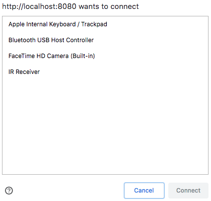

# USB: a web developer perspective

One of the reason I really like my job is because I get to work with the technologies that I love. Two of these technologies are JavaScript and IoT. Now, I know you might think I'm crazy when I say this next part, but one of my favorite pass times is trying to make these two technologies work together. Taking what would generally be considered a "dumb" device and making it smart by using JavaScript and the web. For this reason I was really excited when I heard about WebUSB.

The WebUSB API allows us to access USB devices from the browser. There are a number of tutorials, articles and talks online which explain what the purpose of this new technology is and how to use it. The following list has some of the resources I have been using:

- [Access USB Devices on the Web](https://developers.google.com/web/updates/2016/03/access-usb-devices-on-the-web)
- [Exploring WebUSB and its exciting potential - Suz Hinton - JSConf US 2018](https://www.youtube.com/watch?v=IpfZ8Nj3uiE)
- [WebUSB API Spec](https://wicg.github.io/webusb/)

These are all great resources, and there are so many more. However, almost all of the resources I have looked at for WebUSB say one very important thing:

> You have to understand how the USB standard works in order to be able to use this API.

This seems like a reasonable statement, in order to use something you should understand it, right? There are also some really good resources on understanding the USB standard, for example [USB in a NutShell](https://www.beyondlogic.org/usbnutshell/usb1.shtml). If you are a web developer like me, and reading hundreds of pages of hardware architecture is not really your thing, then keep reading.

This blog post is the short (web developer) version of the USB standard, the parts I needed in order to hack some USB devices with JavaScript. Let's take a look at some code ([adapted from this post](https://developers.google.com/web/updates/2016/03/access-usb-devices-on-the-web)):

```js
let vendorId = 0x00;
let device = await navigator.usb.requestDevice({ filters: [{ vendorId }] });

await device.open();
await device.selectConfiguration(1);
await device.claimInterface(2);

await device.controlTransferOut({
    requestType: 'class',
    recipient: 'interface',
    request: 0x22,
    value: 0x01,
    index: 0x02});

let result = await device.transferIn(5, 64);
console.log(`Received: ${result}`);
```

The WebUSB API relies heavily on promises, as you can see in the code above. Assuming that you are familiar with promises, lets move on to the parts that are related to the API:

## Vendor ID

```js
let vendorId = 0x00;
```

The vendor ID is a hexadecimal number that is assigned by the [USB-IF](https://www.usb.org/) and the manufacturer of the device. This ID as well as the product ID can be added to the filters of the request device method. If there are no filters specified then all of the USB devices plugged in to your computer will be returned.

## Request devices

```js
let device = await navigator.usb.requestDevice({ filters: [{ vendorId }] });
```

This method can only be called from a user gesture, for instance a button click. This is a security feature, it means that you as the user have to initiate the scan for USB devices plugged into your computer. This scan produces a list of devices and allows you to choose one to connect to.

For example, if I run the following code on my computer:

```js
let device = await navigator.usb.requestDevice({ filters: [] });
```

I get the result:



## Connect

```js
await device.open();
```

Choosing one of the devices in the image above and clicking "Connect" means that you are giving this website permission to connect to this device. The connection is started by calling the `open()` method.

## Select configuration

```js
await device.selectConfiguration(1);
```

Now that we have established a connection we have to find which of the device's configurations we can communicate with. There are not many devices that have more than one configuration. The configuration consists of values for the amount of power needed, if the device is self or bus powered and the number of interfaces it has. The important part to remember here is that only one configuration is enabled at a time. The enabled configuration is how, for example, your cellphone knows if it is plugged into a laptop or straight into the mains.

## Claim interface

```js
await device.claimInterface(2);
```

Next we have to claim the interface. An interface is grouping of functions of the device which together form one feature that the device can perform. By claiming the interface we are taking control of that particular feature of the device. We do that by communicating with the input and output endpoints of the selected interface.

## Control transfer

```js
await device.controlTransferOut({
    requestType: 'class',
    recipient: 'interface',
    request: 0x22,
    value: 0x01,
    index: 0x02});
```

This method sends a message from your computer to the device. The control transfer methods are used for device configuration. It pretty much sets up the device, class or interface to be able to communicate with your computer. It requires a number of options to be set on it:

1. `requestType`: specifies whether the request we are sending is a vendor specific protocol, part of the USB standard or - like in our code - a specific class on the USB device.
1. `recipient`: sets whether we are transferring control to the device as a whole, or a specific endpoint or interface.
1. `request`: determines what we are requesting the device to do. Requests can be set by the USB standard, the device class specification or they can be vendor specific.
1. `value` and `index`: These are populated based on the previous fields. In our example the `value` is set based on what the class specification expects and the `index` is set to the interface number because our `recipient` is the interface.

These options together are sent as a header to the default control transfer endpoint. Every USB device has a default endpoint, usually `endpointNumber` 0. 

## Transfer

```js
let result = await device.transferIn(5, 64);
console.log(`Received: ${result}`);
```

Lastly, we are saying that we want to wait for the device to send us some data. We provide the endpoint on which we will be listening, this is a different endpoint to the default one. We also state how many bytes we are expecting to receive from that endpoint.

## Why so many numbers?

One thing you may be thinking right now is, why are there so many seemingly random numbers in this code?

Well, they are not random, they all come from somewhere, usually the device or vendor specifications, here is how you can find them:

- **Vendor ID** and/or **product ID**: These can be found in different ways based on your operating system. For example, on MacOS you need to go to the 🍎 icon, choose _About This Mac_, _System report..._ and under _Hardware_ click on _USB_. You can also check [this list](http://www.linux-usb.org/usb.ids) and see if the device you have is in there.
- **Configuration** and **interface**: If you have the data sheet for your USB device then these should be listed in there. If you do not, you can start at 0 and try a few different numbers. The WebUSB API gives you an error saying that the configuration/interface does not exist. If you receive this error you increase the number by 1 and try again until you find the correct number.
- **Endpoints** and **data** to transfer **in**/**out**: If you are trying to play with a USB device that is not programmable and does not have open source drivers that you could take a look at, then this part is a little more difficult. You will need to install the actual device drivers on your computer and then use a tool like Wireshark to see what packets are being sent between the device and your computer.

## Conclusion

The WebUSB API provides us with really cool new opportunities to access hardware using JavaScript. Although there are still some security concerns and quite a few support concerns ([see here](https://caniuse.com/#feat=webusb)) it is still an exciting prospect and I look forward to learning more about it.