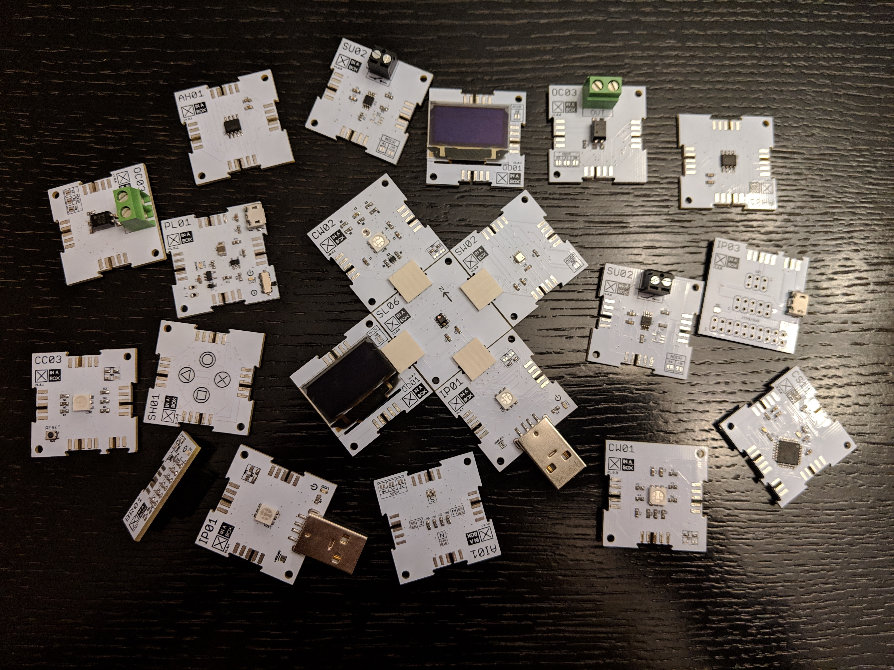
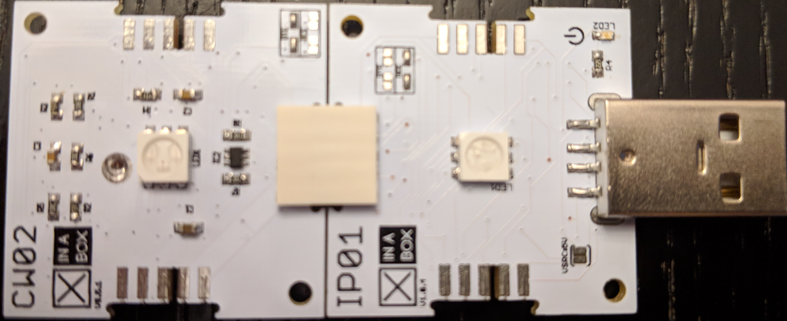
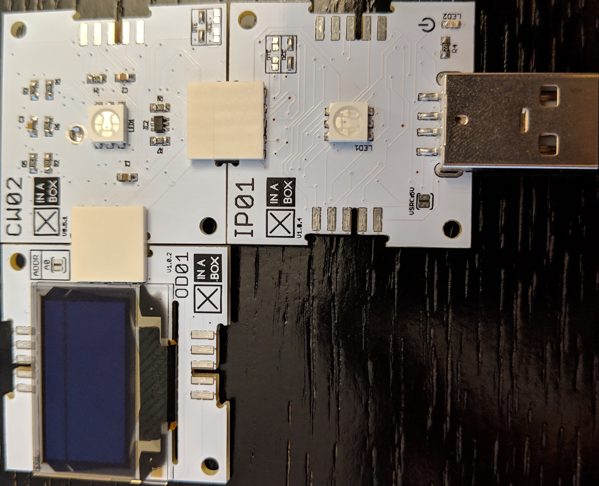
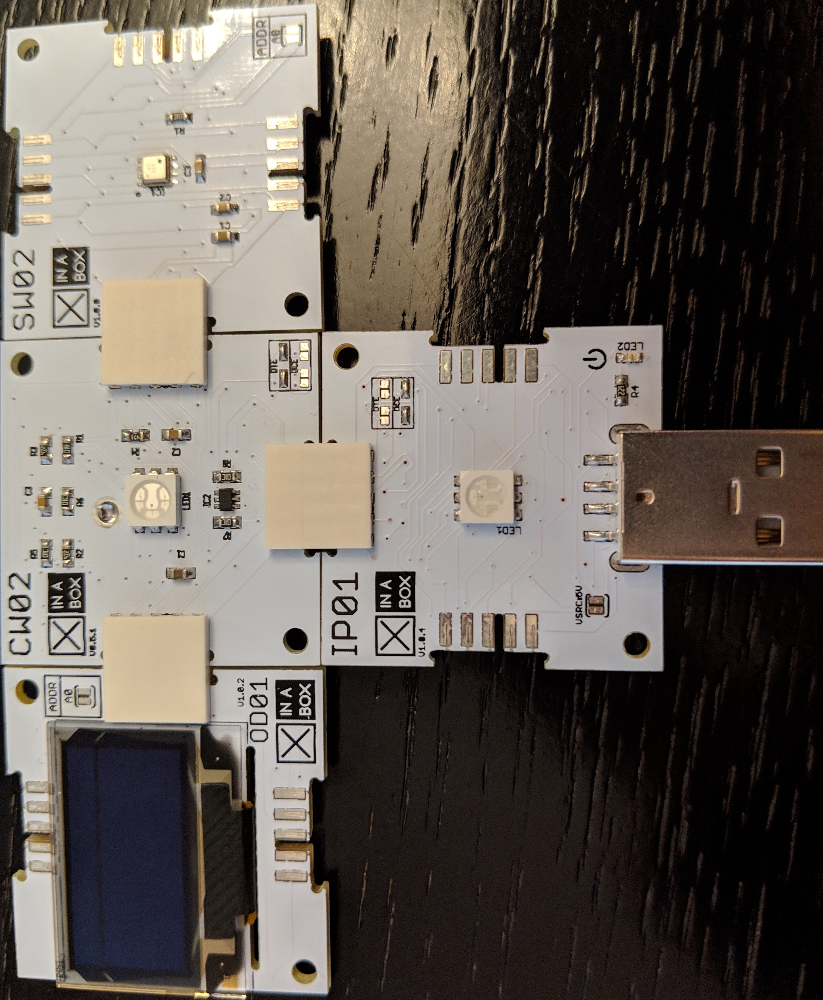

# Playing with XinaBox Part 1



With IoT becoming such a large part of our lives, I have often come across developers who want to get started but have no idea how. Why is that? Well, it is probably related to one of my favorite programmer jokes:

> How many developers does it take to screw in a light bulb? They can't, it's a hardware problem.

I am one of these people, I struggle to understand the hardware, but I really enjoy writing the software. That was until I started playing with [XinaBox](https://xinabox.cc/). These lego like electronics, allow you to clip different chips together and get prototyping quickly and efficiently. All XinaBox chips are based off of other popular chips used in prototyping, making it easy to find libraries and tutorials.

### What you will need
- A computer with the [Arduino IDE](https://www.arduino.cc/en/Main/Software) installed
- The core processing chip: XinaBox [CW02](https://wiki.xinabox.cc/CW02_-_Wi-Fi_%26_Bluetooth_Core)
- The programming interface: XinaBox [IP01](https://wiki.xinabox.cc/IP01_-_USB_Programming_Interface)
- The LED screen: XinaBox [OD01](https://wiki.xinabox.cc/OD01_-_OLED_Display_128x64)
- The temperature sensor: XinaBox [SW02](https://wiki.xinabox.cc/SW02_-_VOC_and_Weather_Sensor)
- Three [xBus](https://wiki.xinabox.cc/Connectors) connectors to put everything together

### Blinking an LED
Let’s start with the electronics equivalent of “Hello World”, blinking an LED. The chip we will be using as our core processing chip for this tutorial is the XinaBox CW02 which has an Espressif ESP32 chip. In order to be able to program for that chip we need to make some configurations changes to the IDE:

- Open _Preferences_ and in the additional boards field paste the following URL: `https://dl.espressif.com/dl/package_esp32_index.json`
- Then in _Tools_ - _Boards_ - _Boards Manager_ search for *ESP32* and install it.

Once installed, you will need to select *ESP32 Dev Module* as the board you are programming. If you struggle with this part, [check out the official instructions](https://github.com/espressif/arduino-esp32).

In order to program our core chip we need to be able to plug it into our computer, for that we will use one of the programming interface xChips, the IP01. Clip the two chips together and plug them into your USB port:



Once plugged in you can select a port in the IDE under the tools menu (if _Port_ is disabled try closing the IDE and opening it again). Port names differ based on device and operating system, for example, on my Mac the port is named `/dev/cu.usbserial-....`, while on my colleague's Windows machine the correct port was `COM8`.

Last bit of setup we need to do before we can blink the LED is to install the xCore library, this library provides us with some basics for controlling the xChips. You can download the zipped file from [the XinaBox GitHub account](https://github.com/xinabox/arduino-CORE) and import it into your IDE by going to _Sketch_ - _Include Library_ - _Add .ZIP Library..._

Now we are finally ready to code, the CW02 chip comes with an RGB LED and this is what the code for blinking this LED looks like:

```c
#include <xCore.h>
#include <xVersion.h>

#define RED_PIN 25
#define GREEN_PIN 26
#define BLUE_PIN 27

void setup() {
  Wire.begin();

  pinMode(RED_PIN, OUTPUT);
  pinMode(GREEN_PIN, OUTPUT);
  pinMode(BLUE_PIN, OUTPUT);
}

void loop() {
  digitalWrite(RED_PIN, HIGH);
  delay(1000);
  digitalWrite(RED_PIN, LOW);
  digitalWrite(GREEN_PIN, HIGH);
  delay(1000);
  digitalWrite(GREEN_PIN, LOW);
  digitalWrite(BLUE_PIN, HIGH);
  delay(1000);
  digitalWrite(BLUE_PIN, LOW);
}
```

This code does the following:

- It includes the xCore library
- It defines the red, green and blue pins
- It initialises the core chip by calling `Wire.begin();` and sets the three pins to output mode
- It then loops through turning each colour on and off every one second.

Hit the upload button in the Arduino IDE (the arrow in the top left corner) and you should have a blinking LED.

### Actual Hello World

The next chip we are going to add onto our setup is the OD01. This little LED screen can do quite a lot, but for now let's just make it say hello. Again we need to start by [downloading and importing the zipped library from GitHub](https://github.com/xinabox/arduino-OD01). Then unplug the chips from your computer and clip in the screen chip.



Once that's in we need to make some changes to the code:

- Include the OD01 library and define the property:
    ```c
    #include "xOD01.h"
    xOD01 OD01;
    ```
- In the setup method after we initialise the core chip we need to initialise the screen:
    ```c
    OD01.begin();
    ```
- There are multiple methods that can be used with the screen, the most common of which are `print`, `println` and `clear`. Add the following code to the bottom of the loop method:
    ```c
    OD01.set2X();
    OD01.print("Hello ");
    OD01.set1X();
    OD01.println("World");
    delay(5000);
    OD01.clear();
    ```

Upload the new code and see the changes in action.

### Hows the weather

When we first got these xChips some of them were brand new, which meant that there were no libraries available for them on the XinaBox GitHub pages. One such chip was the SW02. It is a temperature, humidity, pressure and gas resistance sensor all in one and with it being so hot in Johannesburg lately this is the one I really wanted to play with. As I mentioned earlier all xChips are based on other popular prototyping chips, and this one in particular is based on the *Bosch Sensortech BME680*. After some digging, I found out how to make this chip work without having the XinaBox specific library.

Open up _Sketch_ -> _Include Library_ -> _Manage Libraries..._, search for BME680 and install *ClosedCube BME680* (if you read the description at the bottom you will see that it says it is for the Bosch Sensortech BME680 sensor). Unplug your chips and add the SW02.



Now for some more code changes:

- Include the library and define the property:
    ```c
    #include "ClosedCube_BME680.h"
    ClosedCube_BME680 bme680;
    ```
- Initialise the sensor (don't forget to call this method from the `setup()` method)
    ```c
    void initSensor()
    {
        bme680.init(0x76);
        bme680.reset();
        bme680.setOversampling(BME680_OVERSAMPLING_X1, BME680_OVERSAMPLING_X2, BME680_OVERSAMPLING_X16);
        bme680.setIIRFilter(BME680_FILTER_3);
        OD01.println("Connected to sensor");
        digitalWrite(GREEN_PIN, HIGH);
    }
    ```
- Get the readings by replacing the `loop()` method with the following:
    ```c
    void loop() {
        bme680.setForcedMode();
        double temperature = bme680.readTemperature();
        OD01.print("Temperature: ");
        OD01.print(temperature);
        OD01.println(" C");
        double pressure = bme680.readPressure();
        OD01.print("Pressure: ");
        OD01.print(pressure);
        OD01.println(" hPa");
        double humidity = bme680.readHumidity();
        OD01.print("Humidity: ");
        OD01.print(humidity);
        OD01.println(" %");
        uint32_t gas = bme680.readGasResistance();
        OD01.print("Gas: ");
        OD01.print(gas);
        OD01.println(" Ohms");
        delay(10000);
    }
    ```

Hit upload and see the readings displayed on the screen.

### Conclusion

So we have some cool chips setup and working together. You can take a look at [the final code on my GitHub](https://github.com/geryb-bg/gery-web/blob/master/blog/XinaBox%20Tutorial/Part%201/code.ino). In part two, I would like to show you how to get this data to the cloud.