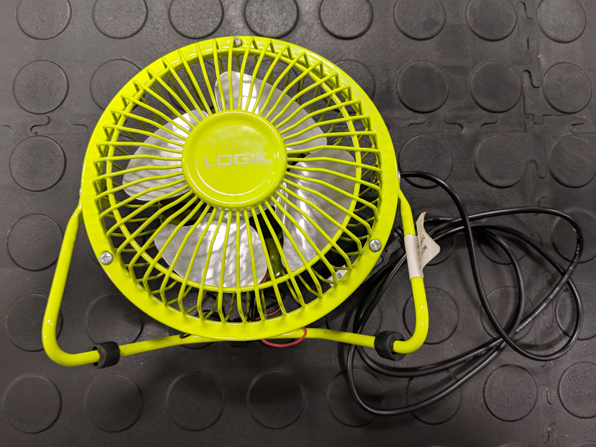
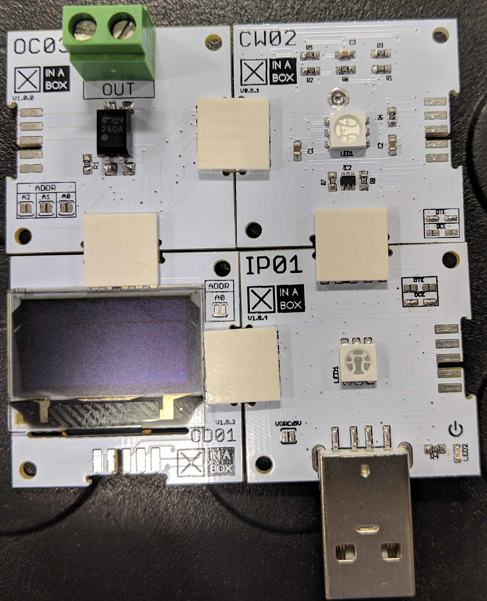
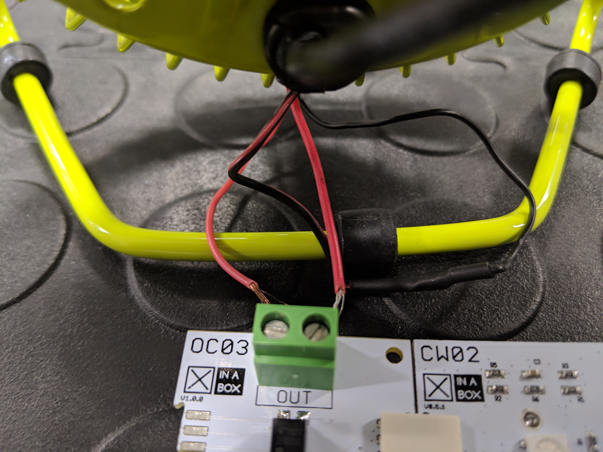

# Playing with XinaBox Part 3


Thanks to parts [one](https://medium.com/@gerybbg/playing-with-xinabox-part-1-cfb742b676e7) and [two](https://medium.com/@gerybbg/playing-with-xinabox-part-2-77f5abdc409b) of this tutorial series we now have a fancy thermometer that is connected to the internet and sending data to the cloud. This data is stored inside the PubSub topic we created.

In this part of the tutorial series we are going to use a cloud function to subscribe to the PubSub topic, read the data and forward it onto another device which can turn a fan on and off based on the temperature. Let's get started.

### What you will need

- The XinaBox [device](https://medium.com/@gerybbg/playing-with-xinabox-part-1-cfb742b676e7) we built in part 1
- The [GCP project](https://medium.com/@gerybbg/playing-with-xinabox-part-2-77f5abdc409b) we created in part 2
- The [Google Cloud SDK](https://cloud.google.com/sdk/docs/downloads-interactive) for deploying the Cloud Function.
- A second XinaBox device consisting of:
    - A core processing chip: XinaBox [CW02](https://wiki.xinabox.cc/CW02_-_Wi-Fi_%26_Bluetooth_Core)
    - A programming interface: XinaBox [IP01](https://wiki.xinabox.cc/IP01_-_USB_Programming_Interface)
    - An LED screen: XinaBox [OD01](https://wiki.xinabox.cc/OD01_-_OLED_Display_128x64)
    - A relay: XinaBox [OC03](https://wiki.xinabox.cc/OC03_-_Relay_Out)
    - Four [xBus](https://wiki.xinabox.cc/Connectors) connectors to put everything together
- A USB powered fan
    

### The new device
Clip all of the chips together:



Depending on the fan you chose you may need to do a little soldering. I took my fan apart and moved the two red wires from the fan's switch to the relay:



This device will have a very similar setup to the previous one we worked with, it will also start all of the components up, connect to the internet, set the time and connect to the cloud.

> Remember that you will need to create a new device in the GCP console as well as a new private/public key pair.

Take a look at the code below, it should look very similar to the code we have already written, the differences are marked with comments.

```c
#include <xCore.h>
#include <xVersion.h>

#include "config.h"

#include "xOD01.h"
xOD01 OD01;

//including the relay library and declaring a relay
#include <xOC03.h>
xOC03 OC03;

#include <MQTT.h>
#include <CloudIoTCore.h>
#include <WiFi.h>
#include <WiFiClientSecure.h>

WiFiClientSecure *netClient;
MQTTClient *mqttClient;
CloudIoTCoreDevice *device;
unsigned long iss = 0;
String jwt;

void setup() {
  Wire.begin();
  OD01.begin();
  OC03.begin(); //starting the relay
  
  pinMode(BLUE_PIN, OUTPUT);
  pinMode(RED_PIN, OUTPUT);
  pinMode(GREEN_PIN, OUTPUT);

  initWifi();
  syncTime();
  initCloudIoT();
}

void initWifi() {
  digitalWrite(RED_PIN, HIGH);
  OD01.println("Connecting to:");
  OD01.println(WIFI_SSID);

  WiFi.begin(WIFI_SSID, WIFI_PASSWORD);
  while (WiFi.status() != WL_CONNECTED)
  {
    OD01.println("Retry in 5 secs");
    WiFi.begin(WIFI_SSID, WIFI_PASSWORD);
    delay(5000);
  }

  digitalWrite(RED_PIN, LOW);
  OD01.println("Connected to WiFi");
}

void syncTime() {
  configTime(0, 0, "pool.ntp.org", "time.nist.gov");
  while (time(nullptr) < 1510644967) {
    delay(10);
  }
}

void initCloudIoT() {
  device = new CloudIoTCoreDevice(
      project_id, location, registry_id, device_id, 
      private_key_str);

  netClient = new WiFiClientSecure();
  mqttClient = new MQTTClient(512);
  mqttClient->begin("mqtt.googleapis.com", 8883, *netClient);
  //** this is one of the places we will add new code
  OD01.println("MQTT started");
}

void loop() {
  if (!mqttClient->connected()) {
    digitalWrite(RED_PIN, HIGH);
    if (WiFi.status() != WL_CONNECTED) {
      initWifi();
    }
    mqttConnect();
    digitalWrite(RED_PIN, LOW);
  }

  OD01.print(".");
  delay(500);
}

void mqttConnect() {
  while (!mqttClient->connect(device->getClientId().c_str(), "unused", getJwt().c_str(), false)) {
    delay(1000);
  }
  OD01.println("Connected to MQTT");
  mqttClient->subscribe(device->getConfigTopic());
  mqttClient->subscribe(device->getCommandsTopic());
}

String getJwt() {
  if (iss == 0 || time(nullptr) - iss > 3600) {
    iss = time(nullptr);
    jwt = device->createJWT(iss);
  }
  return jwt;
}
```

If you have followed along with all the other parts of this tutorial series, the only thing you will need in order for this code to work is to add the [XinaBox OC03 (relay) library](https://github.com/xinabox/arduino-OC03) to your Arduino IDE.

Upload the code to the device and check that it connects successfully.

### Getting configuration data from the cloud

There are a few things we need to add in order to be able to receive data from the cloud. The first is one the line inside the `initCloudIoT()` method that is commented out (the one starting with `//**`). Replace this commented out line with this line:

```c
mqttClient->onMessage(messageReceived);
```

We are telling the MQTT Client that we can expect messages from the cloud. Now we need to implement the `messageReceived()` method that will decide what needs to be done with these messages:

```c
void messageReceived(String &topic, String &payload) {
  OD01.println(".");
  OD01.println(payload);
  float f = atof(payload.c_str());
  if (f > 30) {
    OC03.write(HIGH);
  } else if (f < 20) {
    OC03.write(LOW);
  }
}
```

This method says that when we receive a message, we will print that message on the screen. After that we will check, if the temperature we received is greater than 30 degrees Celsius we will turn the fan on by writing `HIGH` to the relay and if it is lower than 20 degrees Celsius we will turn it off by writing `LOW`.

We are almost done, there is one more thing we need to do. To ensure that the device continues listening for messages from the cloud we need to add an MQTT client loop method inside our existing `loop()` method. Add the following two lines to the top of the `loop()` method:

```c
mqttClient->loop();
delay(10);
```

Upload this code to the device and we can test it. Once the device has started up open the Google Cloud console. Navigate to the device inside your device registry by selecting your project, clicking on *IoT Core* in the side nav, select your registry, click on *Devices* and select your device. On the device's page, click on *UPDATE CONFIG*, make sure that *Text* is selected, type in 35 and click *SEND TO DEVICE*. In a few seconds, the device should receive the message and the fan should turn on.

### Cloud functions

The last thing we want to achieve is to add something in between the two devices so that the whole process does not require any manual interventions. Something that can subscribe to the PubSub topic we created and forward the messages on. This 'thing' is a [Cloud Function](https://github.com/GoogleCloudPlatform/community/tree/master/tutorials/iot-device-to-device/dev2dev) written in JavaScript and it looks like this:

```javascript
'use strict';
const { google } = require('googleapis');

const projectId = 'Your-Project-Id';
const cloudRegion = 'europe-west1';
const registryId = 'Your-Registry-Id';
const deviceId = 'Your-Device-Id';

exports.DeviceToDeviceFunction = function(event, callback) {
  if (event.data) {
    const record = JSON.parse(Buffer.from(event.data, 'base64').toString());

    google.auth.getClient()
      .then(client => {
        google.options({ auth: client });

        const registryName = `projects/${projectId}/locations/${cloudRegion}/registries/${registryId}`;
        binaryData = Buffer.from(record.temperature.toString()).toString('base64');

        const request = {
          name: `${registryName}/devices/${deviceId}`,
          versionToUpdate: 0,
          binaryData: binaryData
        };
        return google.cloudiot('v1').projects.locations.registries.devices
            .modifyCloudToDeviceConfig(request);
      })
      .then(result => {
        console.log(result);
      });
  }
};
```

The function does the following:

- It sets up all of the configuration at the top with project ID, device ID, etc.
- It authenticates using the default Google auth. This part does not require any configuration because the function and devices are running in the same project.
- It then puts the temperature reading into a binary string and sends it onto the device by using the `modifyCloudToDeviceConfig` method.

The last thing left to do is to deploy the cloud function and test that it works. You can deploy it with the following command:

```
gcloud functions deploy relayCloudIot /
    --runtime nodejs8 /
    --trigger-topic=your-topic
```

### Conclusion

Once your function is deployed everything should work. If something is not working as expected you can take a look at the [complete code on GitHub]() to make sure you did not miss anything. In the next part of this series we are going to talk about using Actions on Google to get information from our devices and send information to them using the Google Assistant.